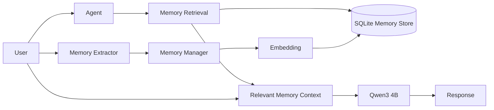

# Build Agent Memory From Scratch

A hands-on implementation of **agent memory using Python, Ollama, SQLite, and embeddings**.

This project accompanies **Day 3 of the Agent Memory Series**, where we build an agent memory system from scratch without using LangChain, LangGraph, or a managed memory service.

The goal is not to build a production-ready memory system.

The goal is to understand what actually happens when an AI agent **remembers something**.

## What We're Building

The agent can:

* Store useful information about a user
* Persist memories beyond the current conversation
* Retrieve stored memories
* Inject relevant memories into the LLM's context
* Use an LLM to decide what is worth remembering
* Assign memory type, importance, and confidence
* Generate embeddings for memories
* Perform semantic memory retrieval
* Rank memories based on relevance

The complete flow is:

```text
User Message
     |
     +----------------------+
     |                      |
     v                      v
Memory Retrieval      Memory Extraction
     |                      |
     v                      v
Relevant Memories     Worth Remembering?
     |                      |
     v                    Yes
Context Injection          |
     |                      v
     v                 Memory Manager
    LLM                       |
     |                        v
     v                    Embedding
Response                      |
                              v
                           SQLite
```

---

## Tech Stack

| Component        | Technology        |
| ---------------- | ----------------- |
| Language         | Python            |
| LLM              | Qwen3 4B          |
| Embeddings       | nomic-embed-text  |
| Local AI Runtime | Ollama            |
| Database         | SQLite            |
| Package Manager  | uv                |
| Semantic Search  | Cosine similarity |

No external LLM API is required.

Everything runs locally through Ollama.

---

## Architecture

The project intentionally keeps the architecture simple.



There are two important paths.

### Retrieval path

When the user sends a message:

```text
User Message
     |
     v
Create Query Embedding
     |
     v
Compare Against Stored Memories
     |
     v
Rank Memories
     |
     v
Select Top K
     |
     v
Inject Into LLM Context
     |
     v
Generate Response
```

### Memory extraction path

After processing the user's message:

```text
User Message
     |
     v
Memory Extractor
     |
     v
Should This Be Remembered?
     |
   +---+---+
   |       |
  No      Yes
   |       |
Discard   Memory Manager
           |
           v
       Create Embedding
           |
           v
        SQLite
```

The LLM proposes a memory.

The application is responsible for deciding what to persist.

---

## Project Structure

```text
agent_memory/
│
├── main.py
├── agent.py
├── extractor.py
├── memory.py
├── retrieval.py
├── pyproject.toml
├── uv.lock
└── agent_memory.db
```

### `main.py`

The entry point for the interactive agent.

It initializes the database, creates the agent, and starts the conversation loop.

### `agent.py`

Coordinates the complete memory lifecycle:

* Retrieve relevant memories
* Build the LLM context
* Generate the response
* Extract potential memories
* Store new memories

### `extractor.py`

Uses Qwen3 to analyze user messages and determine whether they contain information worth remembering.

The extractor returns structured information such as:

```json
{
  "should_remember": true,
  "memory": "User is preparing for a backend engineering interview.",
  "memory_type": "semantic",
  "importance": 0.9,
  "confidence": 0.95
}
```

### `memory.py`

Handles persistent memory storage using SQLite.

It contains functions for:

* Initializing the database
* Saving memories
* Retrieving memories
* Updating memories
* Deleting memories

### `retrieval.py`

Handles semantic retrieval.

It:

1. Creates embeddings
2. Calculates cosine similarity
3. Combines similarity with importance and confidence
4. Returns the most relevant memories

---

## Prerequisites

You'll need:

* Python 3.12+
* [Ollama](https://ollama.com/)
* [uv](https://docs.astral.sh/uv/)
* Git

You also need enough resources to run the local models.

The project uses **Qwen3 4B** for the agent and memory extraction, and **nomic-embed-text** for embeddings.

---

## Setup

### 1. Clone the repository

```bash
git clone <your-repository-url>
cd agent_memory
```

### 2. Install dependencies

```bash
uv sync
```

### 3. Download the Ollama models

```bash
ollama pull qwen3:4b
```

```bash
ollama pull nomic-embed-text
```

You can verify that both models are available:

```bash
ollama list
```

You should see both models listed.

---

## Run the Agent

Start the application with:

```bash
uv run .\main.py
```

On macOS/Linux:

```bash
uv run ./main.py
```

You should now be able to have a conversation with the agent.

For example:

```text
You: I am a platform engineer.

Agent: That's interesting. What kind of platform engineering
work are you currently focused on?

[Extracting memory...]
[Memory decision: True]
[Memory saved]
```

Continue the conversation:

```text
You: I work with Kubernetes.

Agent: Kubernetes is a common part of platform engineering...
```

Later, ask something related:

```text
You: What technologies from my experience might be useful
for backend engineering?
```

The retrieval system will search the stored memories and provide the relevant ones to the LLM.

---

## Viewing Stored Memories

The interactive application supports:

```text
/memories
```

This displays the memories currently stored for the user.

You can use this to see what the memory extractor decided to persist.

---

## How Memory Works

A useful way to understand this project is as a pipeline.

### 1. User sends a message

```text
"I'm preparing for a backend engineering interview."
```

### 2. Retrieve existing memories

The message is converted into an embedding and compared against stored memory embeddings.

### 3. Build the LLM context

The most relevant memories are added to the prompt.

### 4. Generate the response

Qwen3 receives the current message along with the relevant memory context.

### 5. Extract a potential memory

The user's message is sent through the memory extractor.

### 6. Decide whether to remember it

The extractor returns a structured result.

### 7. Generate the memory embedding

If the memory is worth storing, we generate an embedding for it.

### 8. Persist the memory

The memory and its metadata are stored in SQLite.

The next conversation can retrieve it.

---

## Memory Types

The extractor currently supports three memory types:

### Semantic

Facts about the user.

Examples:

```text
User is a platform engineer.
User prefers FastAPI over Django.
User works with Kubernetes.
```

### Episodic

Events or experiences involving the user.

Examples:

```text
User completed a Kubernetes certification.
User recently started a backend project.
```

### Procedural

How the user prefers something to be done.

Examples:

```text
User prefers concise explanations.
User prefers Python examples.
```

The implementation is intentionally simple. A production memory system would likely need a more sophisticated memory model.

---

## Memory Metadata

Each memory can contain additional metadata:

```text
content
memory_type
importance
confidence
embedding
status
created_at
updated_at
```

For example:

```json
{
  "content": "User prefers FastAPI over Django",
  "memory_type": "semantic",
  "importance": 0.8,
  "confidence": 0.95,
  "status": "active"
}
```

The metadata gives the retrieval system additional signals beyond semantic similarity.

---

## Retrieval

The project deliberately does not use a vector database.

Instead, it demonstrates the underlying mechanism directly.

The process is:

```text
Query
  |
  v
Embedding
  |
  v
Compare with stored embeddings
  |
  v
Cosine similarity
  |
  v
Ranking
  |
  v
Top K memories
```

The current ranking formula is intentionally simple:

```text
score =
    similarity * 0.7
    + importance * 0.2
    + confidence * 0.1
```

These weights are for demonstration purposes, not a universal memory-ranking strategy.

The purpose is to understand what a vector search system is doing underneath the abstraction.

---

## Why SQLite?

SQLite is being used intentionally.

For this project, we want to understand the memory lifecycle without introducing another layer of abstraction.

SQLite gives us:

* Persistent storage
* A simple relational schema
* No database server
* No Docker setup
* Built-in Python support
* Easy inspection of stored memories

In a production system with large-scale semantic retrieval, we would likely use a different storage architecture.

That's something we'll explore in the next part of the series.

---

## What This Project Does Not Solve

This is a learning implementation, not a production memory system.

It does not fully solve:

* Duplicate memories
* Contradictory memories
* Stale memories
* Memory expiration
* Memory deletion policies
* Memory poisoning
* Privacy
* Multi-tenancy
* Access control
* Large-scale vector search
* Retrieval latency
* Observability
* Cost optimization

For example, consider:

```text
I used Kubernetes at my previous company.
```

and later:

```text
I now use AWS ECS.
```

A real memory system needs to understand the relationship between these memories rather than blindly storing both as independent facts.

Those problems become increasingly important as the memory store grows.

---

## Why Build This Without a Framework?

Frameworks can make it much easier to build agents.

But they can also hide the individual operations involved.

By building this system ourselves, we can see that "memory" is not one operation.

It is a collection of operations:

```text
Extract
   ↓
Represent
   ↓
Store
   ↓
Retrieve
   ↓
Rank
   ↓
Inject
   ↓
Update
   ↓
Forget
```

Once we understand these pieces, it's much easier to understand what agent frameworks and managed memory systems are actually providing.

---

## Part of the Agent Memory Series

This project is part of a 7-part series exploring how memory works in AI agents.

**Day 1 — Does an Agent Need Memory?**

Why context, knowledge, skills, and memory are different concepts.

**Day 2 — The 3 Types of Memory**

Semantic, episodic, and procedural memory, and the lifecycle of extracting, storing, retrieving, injecting, updating, and forgetting memories.

**Day 3 — Build Agent Memory From Scratch**

This project.

**Day 4 — Where Memory Lives and Why Retrieval Is Harder Than Storage**

SQL vs Redis vs vector databases vs document stores, and how retrieval changes at scale.

**Day 5 — Agent Memory in Production**

Stale memories, contradictions, poisoning, privacy, multi-tenancy, TTLs, observability, and cost.

**Day 6 — How Providers and Frameworks Handle Memory**

We'll look at how different approaches handle memory and build a similar system with LangGraph.

**Day 7 — Do We Even Need a Memory Database?**

A deeper look at whether every agent actually needs persistent memory.

---

## Learn More

Read the full Day 3 article:

**Build Agent Memory From Scratch**

[Add your blog URL here]

---

## License

This project is intended for learning and experimentation.

Add your preferred license here.
